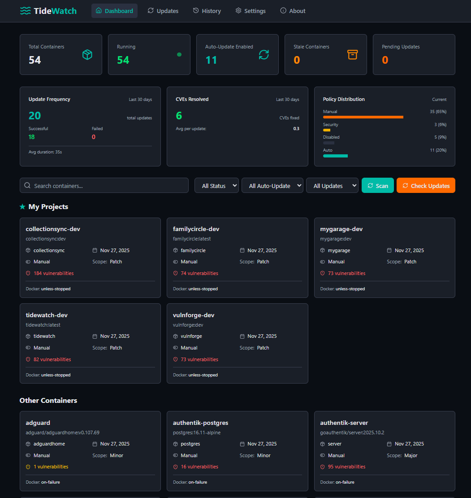

  
Intelligent Docker Container Update Management

---

---

## Key Features

- **Real-time Container Monitoring** - Live status updates with Server-Sent Events
- **Intelligent Update Management** - Schedule updates with dependency ordering
- **Auto-Restart with Backoff** - Exponential backoff for failed containers
- **Dependency Tracking** - Monitor npm, PyPI, Composer, Cargo, and Go modules
- **7 Notification Services** - Gotify, Pushover, Slack, Discord, Telegram, Email, ntfy
- **OIDC/SSO Support** - Enterprise authentication (Authentik, Keycloak, Google, Microsoft)
- **Database Encryption** - AES-128 encryption for sensitive fields
- **Light/Dark Theme** - Automatic system preference detection
- **Self-Hosted** - Your data stays on your infrastructure

**Default Mode**: Runs with no authentication for easy setup. Configure authentication in Settings before exposing to the internet.

📖 **[Complete Installation Guide](https://github.com/homelabforge/tidewatch/wiki/Installation)**

## Support

- **📚 Documentation**: [GitHub Wiki](https://github.com/homelabforge/tidewatch/wiki)
- **🌐 Website**: [homelabforge.io/builds/tidewatch](https://homelabforge.io/builds/tidewatch/)
- **🐛 Bug Reports**: [GitHub Issues](https://github.com/homelabforge/tidewatch/issues)
- **💬 Discussions**: [GitHub Discussions](https://github.com/homelabforge/tidewatch/discussions)

---

## License

MIT License - see [LICENSE](LICENSE) file for details.

---

## Acknowledgments

Built for homelabbers who want intelligent container update management without relying on third-party services.

Part of the [HomelabForge](https://homelabforge.io) ecosystem.

### Development Assistance

TideWatch was developed through AI-assisted pair programming with **Claude** and **Codex**, combining human vision with AI capabilities for architecture, security patterns, and implementation.
